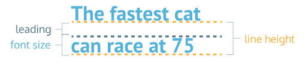

# CSS
## Contents
<!-- no toc -->
- [How to apply styles](#how-to-apply-styles)
- [Visual Rules](#visual-rules)
- [Box Model](#box-model)
- [Text & Fonts](#text-and-fonts)
- [Accesibility Practices](#accessibility-practices)
- [Wireframing](#wireframing)

## How to apply styles
- two main ways to apply styles to an element:
  - selectors
    - applied as a ruleset 
    - there are different types of selectors
      - type selector targets each element of one or more types (the universal selector, *, targets all elements on the page)
        > header { ...
      - class selection will apply to all elements given the selected class value (this one uses the '.' prefix)
        > .brand { ...
      - attribute selection targets all elements that have the selected attribute
        > [href] { ... <br> img[src*='jpg'] { ... //this selects all images whose src contains 'jpg' <br> 
      - the *id* selector is for styling individual elements, and overrides other selections
        > #mydiv { ...
        - *id* must be unique for each page
  - inline
    - applied to individual element
      > < p style="color: blue;">
    - each style should be punctuated ( ; ), even if there is only one
- both use *declarations*, which are the property name and value
- the brackets following the selector delimit the *declaration block*.
- one class value can be targeted by several CSS class selectors by adding the different class names with spaces: class="red bold"
- type selectors can be "chained" together with other selectors like so: 
  > h1.boldclass { ...
  - *descendant* elements can be selected by adding an element type after the first selection (this targets child elements of the first selected element)
    > .main-list li { ...
- the *!important* suffix can be added to an attribute to override any other style, regardless of specificity.
  > color: red !important;
  - this should be avoided unless absolutely necessary.

### Pseudo Classes
Elements can be in different states (hover, visited, disabled, active) and can be selected differently based on their state.
- ex: 
  > p:hover { ...

## Visual Rules
- CSS font properties:
  - *font-family* 
  - *font-size* (px)
  - *font-weight* (bold/normal)
- CSS text properties:
  - *text-align* (l, r, c, justify)
- CSS color properties:
  - *color* (foreground color)
    - this applies to text
  - *background-color* 
- fonts used in CSS must be installed on the user's machine OR downloaded with the site
  - "web safe fonts" are a set of fonts supported across most browsers and OS
  - multi-word font names should use single quotations (e.g. 'courier new')
- text is always left aligned in its parent container by default
- the *opacity* element ranges from 0 to 1
- the *background-image* property uses the following syntax: 
  > background-image: url('https://someurl/image.jpg');
  <br> background-image: url('images/mypicture.jpg');
- *overflow* is awesome (scroll, hidden, visible)
- *visibility* (hidden, visible, collapse)
  - not to be confused with *display*, where setting *display: none;* will entirely remove the element while *visibility: hidden;* will leave an empty space where the element goes, and only hide the content of that element.
## Box Model
- shorthand can be used for margins and padding
  - 1 value: all sides
  - 2 values: top/bottom sides
  - 3 values: top sides bottom
  - 4 values: top right bottom left (clockwise)
- the margin property can be used to center content in its parent element like so:
  > margin: 0 auto;
  - this is shorthand for 0 top/bottom margins and auto for the left/right margins
- min/max width/height are best used to limit resizing for screens of different sizes
- default HTML adds padding and border to the width/height, making the real dimensions of a box hard to predict (*content-box*)
  - you can set all elements to use the *box-sizing: border-box;* rule 
  > \* { box-sizing: border-box;
  - this rule keeps height and width fixed, and fits the padding and borders into the specified width/height
- __block elements__ take up the entire width of their containing element
  - they also prevent other elements from appearing in the same horizontal space
  - default position is left
    - position can be changed with the *position* property:
      - static (default, no need to specify)
      - relative (to its default static position)
      - fixed (stays in position regardless of scrolling; often used for nav bars; removes element from flow of page)
      - absolute (other elements ignore it; positioned relative to nearest parent element)
      - sticky (sticks to part of the page as page gets scrolled)
  - positions can be moved using *top, bottom, left, or right* (separate attributes)
    - each specified amount of pixels moves the element away from the specified side of the box
- *z-index*: ```z-index: 25;```
  - default is 0
  - does not work with static elements
### margin collapse
- collapsing is the ignoring of the smaller of two adjacent margins
- top/bottom margins collapse, while horizontal margins do not
### display values
- inline: box is only big enough for the content, does not require new lines before/after
  - height/width cannot be specified in CSS
- inline-block: combines other two
  - height and width can be specified
  - 
- block: takes up the entire width of containing element
  - default setting for divs, headers, footers, h
  - width can be specified in CSS
### float
- used for moving an element inside of its containing element (far left or far right)
- commonly used for wrapping text around an image
- float elements must have width specified 
- *clear* property is used to handle collisions between float elements
  - the values (left, right, both, none), they indicate if the element should render on a new line when they are overlapped by a float element to the (left right or both).  

### flexbox
- two main components:
  - flex containers
    - any element that contains flex items
    - useful for handling changes in screen size
    - created with the attribute `display: flex;` or `display: inline-flex;`
      - inline-flex lets us create a flexbox that is an inline element instead of a block element
    - flex elements take up their entire line width, similar to block elements.
    - uses other properties to specify how its children behave:
      - *justify-content*: positions children from left to right
        - flex-start, flex-end, center, space-around, space-between 
      - *align-items*: positions children vertically
        - flex-start, flex-end, center, baseline, stretch
      - *flex-wrap*: determines if flex items can start on a new line (wrap, none) 
      - *align-content*
      - *flex-direction*
      - *flex-flow*
  - flex items
    - children of flex containers
    - do not begin on new lines
    - common attributes:
      - *flex-grow*: specifies if items should grow with parent container (flex items do not grow with parent container by default)
          - values are used as parts / total parts, where an element with value 2 will grow twice as fast as a 1 (horizontally, as the container grows)
          - max-width will supercede flex-grow
          - default is 0 (no growing)
      - *flex-shrink*: default is 1
      - *flex-basis*: specifies the width of an item before it shrinks (pixel value)
      - __shorthand declaration__ can be used to declare all three at once:
        - `flex: 1 2 90px;` (grow, shrink, basis)
        - or: `flex: 2 90px;` (grow, basis)
        - or: `flex: 1 2;` (grow, shrink)

## Text and Fonts
- *font-family* accepts a single value or a stack of fonts to be used as backups
  - e.g. ```font-family: Consolas, 'Courier New', monospace;```
- *font weight* accepts either a text value (bold, normal, lighter, bolder) or an integer value (1-1000), usually in increments of 100
  - __normal__ = 400
  - __bold__ = 700
  - *not all fonts can be assigned a numeric font weight*
- *font-style* includes italic, normal (default)
- *font-transform* can be used to syle all text characters (uppercase or lowercase)
- both *letter-spacing* and *word-spacing* can be given a pixels value or em value
- font size (em), line leading, and line height breakdown:
  - *line-height* can be given a unitless value, which will make it depend on font size.
- *text-align* can be assigned justify, right, or left (left is default)

### Including other fonts 
- two approaches:
  - host the font with your website
    - download them into one of the file formats listed (OTF, TTF, WOFF, WOFF2) and add it to your project
    - create a `@font-face` rule in your CSS file 
      - use the *font-family* property to specify the name of the font
      - the *src* attribute is given comma-separated pairs of a `url()` and `format()` value
  - use a `<link>` element 
    - this can be done in the head of the html file or in the CSS file using `@import url('')`

## Accessibility practices
- `<a>` elements
  - use some way to distinguish them from other text 
  - hover effects should not be used as a panacea, since they cannot be noticed immediately and are not available on mobile browsers
- *title* can be used to give tooltips when hovering an element 
- four state pseudoclasses (in order):
  - `:link`
  - `:visited`
  - `:hover`
  - `:active`
- Skeumorphism (making things imitate real life counterparts) can lower user learning curve
- flat design (making UI simpler and cleaner) banks on users being familiar with digital UI and not needing skeumorphism

### UX patterns
- __affordances__ consist of what type of interaction users can do with an object. (e.g. bench can be sat on)
- __signifiers__ are features that advertise affordances to users (e.g. handle on teacup) 

### Breadcrumbs
- commonly uses ul/li elements
  - using the `+` (adjacent sibling combinator) lets us select two adjacent elements who share a common parent
  - ex: `.breadcrumb li+li::before { content: ">"; }` will result in the ">" between elements.
    - you can specify to only use it between certain types/classes of elements: `.breadcrumb li.location+li.location::before{ content: ">"; }` or after certain types like this: `. breadcrumb .attribute::after{ content: "x"; vertical-align: super; }`
- must be manually created for each page unless you are the true wizard king
- three types of breadcrumbs:
  - location (where you are in the site)
  - attribute (specification used after a location-based breadcrumb)
    - sometimes removable with "x" button
  - path (follows user's unique path of all breadcrumbs)
    - gets complicated and can be abbreviated with a "..." breadcrumb
- breadcrumbs may confuse users if they behave differently than expected
- not recommended to have them as the only navigation structure

## Wireframing
- similar to an architecture blueprint
- often made for structure, and don't specify color or other aesthetics
- created before mockups or specific design sketches

### from design to website
- after designs are laid out, sometimes you can hit a wall
- think of the sections on pages as using a grid layout
- visual cohesion & continuity
  - make a style guide before building it all 
  - maintain colors and styles, aka dont be stupid
- stay open to change as you build 